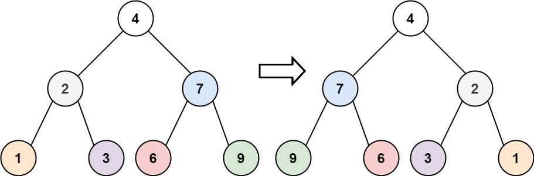

# 翻转二叉树

给你一棵二叉树的根节点`root`，翻转这棵二叉树，并返回其根节点。

## 示例 ：

>### 输入：
>root = [4,2,7,1,3,6,9]
>### 输出：
>[4,7,2,9,6,3,1]

## 代码：

1.

    /**
    * Definition for a binary tree node.
    * public class TreeNode {
    *     public int val;
    *     public TreeNode left;
    *     public TreeNode right;
    *     public TreeNode(int val=0, TreeNode left=null, TreeNode right=null) {
    *         this.val = val;
    *         this.left = left;
    *         this.right = right;
    *     }
    * }
    */

    public class Solution {
        public TreeNode InvertTree(TreeNode root) {
            if (root == null) {
                return null;
            }
            TreeNode left = InvertTree(root.left);
            TreeNode right = InvertTree(root.right);
            root.left = right;
            root.right = left;

            return root;
        }
    }

2.

    /**
    * Definition for a binary tree node.
    * public class TreeNode {
    *     public int val;
    *     public TreeNode left;
    *     public TreeNode right;
    *     public TreeNode(int val=0, TreeNode left=null, TreeNode right=null) {
    *         this.val = val;
    *         this.left = left;
    *         this.right = right;
    *     }
    * }
    */

    public class Solution {
        public TreeNode InvertTree(TreeNode root) {
            if (root == null || (root.left == null && root.right == null))
            {
                return root;
            }
            var tempNode = root.left;
            root.left = root.right;
            root.right = tempNode;
            if (root.left != null)
            {
                InvertTree(root.left);
            }
            if (root.right != null)
            {
                InvertTree(root.right);
            }
            return root;
        }
    }

3.

    /**
    * Definition for a binary tree node.
    * public class TreeNode {
    *     public int val;
    *     public TreeNode left;
    *     public TreeNode right;
    *     public TreeNode(int val=0, TreeNode left=null, TreeNode right=null) {
    *         this.val = val;
    *         this.left = left;
    *         this.right = right;
    *     }
    * }
    */

    public class Solution {
        public TreeNode InvertTree(TreeNode root) {
            if(root==null){
                return null;
            }
            TreeNode left=InvertTree(root.left);
            root.left=InvertTree(root.right);
            root.right=left;
            return root;
        }
    }
